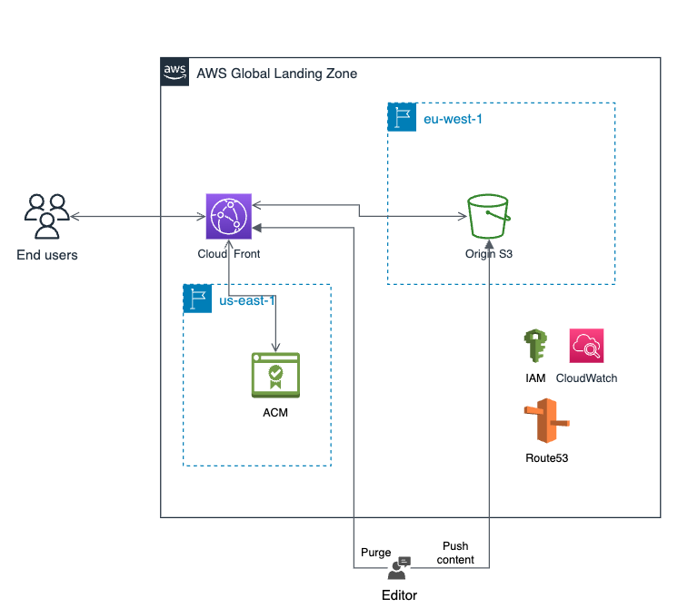

# Terraform Blueprint: Static Website Content

[](https://www.terraform.io/)
[](https://aws.amazon.com/cloudfront/)
[](#shared-terraform-modules-aws)
[](LICENSE)

> Production-ready Terraform blueprint for deploying a secure static website on AWS with CloudFront, private S3 origin, Route 53, CI/CD, and CloudWatch monitoring.

---

## Table of Contents

- [Overview](#-overview)
- [Architecture](#-architecture)
- [Features](#-features)
- [Prerequisites](#-prerequisites)
- [Quick Start](#-quick-start)
- [Multi-Environment Setup](#-multi-environment-setup)
- [Publishing Website Content](#publishing-website-content)
- [Repository Structure](#repository-structure)
- [Shared Terraform Modules](#shared-terraform-modules-aws)
- [Configuration Guide](#configuration-guide)
- [CI/CD Workflow](#-cicd-workflow)
- [Common Operations](#common-operations)
- [Monitoring And Operations](#-monitoring-and-operations)
- [Troubleshooting](#troubleshooting)
- [Contributing](#-contributing)
- [License](#license)

---

## Overview

The Static Website Content blueprint is a production-ready infrastructure-as-code template for deploying secure, scalable static websites on AWS CloudFront with a private S3 origin.

Common use cases:

- documentation portals
- marketing sites
- single page applications
- internal frontends
- landing pages

### Key Features

- **Zero Manual Setup** - Terraform delivery is automated through GitHub Actions
- **Global CDN** - Serves static content through CloudFront edge caching
- **Custom Domain Ready** - Uses Route 53 and ACM for DNS and HTTPS
- **Secure by Default** - Private S3 origin, Origin Access Control, and KMS encryption
- **Monitoring Built-in** - CloudWatch dashboard, alarms, access logs, and SNS notifications
- **Centralized Modules** - Consumes released modules from `terraform-modules-aws`

---

## Architecture



### High-Level Flow

1. Users request the website through a custom DNS name.
2. Route 53 resolves the domain to the CloudFront distribution.
3. ACM provides the TLS certificate used by CloudFront.
4. CloudFront serves cached content from edge locations.
5. CloudFront Origin Access Control authorizes access to the private S3 origin bucket.
6. S3 stores website files such as HTML, CSS, JavaScript, images, and static assets.
7. CloudFront access logs are written to a dedicated logs bucket.
8. CloudWatch dashboards and alarms provide operational visibility.

### Infrastructure Components

| Layer | AWS Service | Purpose |
| --- | --- | --- |
| DNS | Route 53 | Custom domain records for CloudFront |
| TLS | ACM | HTTPS certificate for the CloudFront distribution |
| CDN | CloudFront | Global caching, HTTPS entry point, and custom error responses |
| Storage | S3 origin bucket | Private bucket containing website assets |
| Origin security | Origin Access Control | Restricts S3 access to CloudFront only |
| Logs | S3 logs bucket | CloudFront access log storage |
| Encryption | AWS KMS | Customer-managed encryption for buckets and logs |
| Observability | CloudWatch and SNS | Dashboards, alarms, and email notifications |
| State | S3 backend | Remote Terraform state with native S3 lockfile support |

---

### Security

- **S3 bucket not publicly accessible** - the website origin bucket remains private
- **Access only through CloudFront using OAC** - Origin Access Control restricts direct S3 access
- **All content encrypted at rest with KMS** - buckets and logs use customer-managed encryption
- **TLS 1.2+ enforced for HTTPS connections** - traffic is served securely through CloudFront
- **Access logs stored in a dedicated S3 bucket** - request logging is isolated from website content

---

## Features

| Layer | Component | Purpose |
| --- | --- | --- |
| CDN | CloudFront distribution | Global content delivery with edge caching |
|  | Custom error responses | Supports user-friendly 403/404 pages and SPA routing patterns |
|  | Access logging | Records CloudFront requests for audit and troubleshooting |
| Storage | S3 origin bucket | Hosts website files such as HTML, CSS, JavaScript, and assets |
|  | S3 logs bucket | Stores CloudFront access logs |
|  | Lifecycle policies | Cleans up old object versions and incomplete uploads |
| DNS and TLS | Route 53 hosted zone | Manages custom domain records |
|  | ACM certificate | Provides HTTPS with managed certificate renewal |
| Security | KMS encryption | Encrypts S3 content, logs, and state-related data |
|  | Origin Access Control | Keeps the S3 origin private and accessible only through CloudFront |
| Monitoring | CloudWatch dashboard | Shows request, error, cache, bandwidth, and storage metrics |
|  | CloudWatch alarms | Alerts on error rate, cache behavior, origin failures, and traffic anomalies |
|  | SNS notifications | Sends alarm notifications to the configured email address |
| State Management | Backend module | Remote state in S3 with native S3 lockfile support |
|  | KMS encryption | Encrypts Terraform state data |

---

## Prerequisites

Terraform operations are executed through **GitHub Actions**. Local tools are mainly required for repository changes and website content publishing.

| Requirement | Version | Description |
| --- | --- | --- |
| Terraform | `>= 1.7` | Infrastructure as Code tool |
| AWS CLI | `>= 2.x` | AWS command-line interface for content publishing |
| Git | `>= 2.x` | Version control |
| Domain Name | - | Registered domain managed in Route 53 |
| AWS Account | - | With sufficient permissions for deployment |
| GitHub Repository | - | For CI/CD pipeline integration |

### Required AWS Permissions

The deployment role should have access to these AWS services:

- CloudFront
- S3
- Route 53
- ACM
- KMS
- CloudWatch
- SNS
- IAM

---

## Quick Start

Use this repository by configuring an environment folder, then pushing the change so GitHub Actions can run the Terraform workflows.

### 1. Clone And Configure

```bash
# Clone repository
git clone <repository-url>
cd terraform-blueprint-static-website-content

# Configure environment
cd infrastructure/environments/dev
cp terraform.tfvars.example terraform.tfvars
vim terraform.tfvars
```

### 2. Essential Configuration

Edit `infrastructure/environments/dev/terraform.tfvars`:

```hcl
# Project
project_name = "static-website"
environment  = "dev"
region       = "eu-west-1"

# Domain and DNS (your Route 53 hosted zone)
domain_name = "dev.example.com"
zone_id     = "Z0XXXXXXXXXXXXX"

# CloudFront settings
cloudfront_price_class = "PriceClass_100"
minimum_protocol_version = "TLSv1.2_2021"
log_prefix               = "cloudfront/"

# CloudFront cache settings
min_ttl                = 0
default_ttl            = 3600
max_ttl                = 86400

# Website routing (SPA-friendly default)
default_root_object      = "index.html"
error_404_response_code  = 200
error_404_response_path  = "/index.html"
error_403_response_code  = 200
error_403_response_path  = "/index.html"

# Security and lifecycle
kms_deletion_window_in_days = 30
logs_retention_days         = 90
noncurrent_version_expiration_days     = 30
abort_incomplete_multipart_upload_days = 7

# Monitoring
alert_email   = "your-contact@example.com"
enable_alarms = true
```

### 3. Review The Environment Files

The environment folder contains the Terraform entry point for this deployment:

```text
main.tf
variables.tf
terraform.tfvars
backend.tf
monitoring.tf
outputs.tf
```

For production, make the equivalent changes under `infrastructure/environments/prod`.

### 4. Deploy Via GitHub Actions

```bash
# Commit configuration
git add infrastructure/environments/dev/terraform.tfvars
git commit -m "feat: configure dev static website"

# Push to trigger deployment workflow
git push origin <branch-name>
```

GitHub Actions will:

1. run the `terraform-plan` workflow to show the proposed changes
2. display the `Plan Run ID` in the workflow summary
3. wait for review and approval
4. run the `terraform-apply` workflow when manually triggered by an authorized user

To apply the reviewed plan, open the completed `terraform-plan` run in GitHub Actions and copy the `Plan Run ID` from the workflow summary. Then open `Terraform Apply`, click `Run workflow`, select the same environment, paste the `Plan Run ID`, and type `APPLY` in the confirmation field.

### 5. Confirm SNS Email

Check your email for the AWS SNS subscription confirmation and click `Confirm subscription`.

### 6. Access Website

Your website will be available at:

```text
https://dev.example.com
```

Use the domain configured in `domain_name` for the target environment.

---

## Multi-Environment Setup

Production environment configuration already exists in `infrastructure/environments/prod/`.

To deploy production:

```bash
# 1. Update production configuration
vim infrastructure/environments/prod/terraform.tfvars
```

Review and adjust the production-specific values, especially:

- `domain_name`
- `zone_id`
- `cloudfront_price_class`
- `logs_retention_days`
- `noncurrent_version_expiration_days`
- `alert_email`

```bash
# 2. Commit and push to main branch
git checkout main
git add .
git commit -m "feat: configure production environment"
git push origin main
```

Then:

1. Review the `terraform-plan` workflow output in GitHub Actions.
2. Open `Terraform Apply`.
3. Select the `prod` environment.
4. Enter the `Plan Run ID`.
5. Type `APPLY` and confirm.

Production requires approval through the GitHub `production` environment.

---

## Publishing Website Content

Infrastructure deployment creates the hosting platform. Website files are published separately.

Use:

```bash
./deploy-content.sh dev
```

or:

```bash
./deploy-content.sh prod
```

The script is expected to:

- read Terraform outputs for the target environment
- sync static files to the S3 origin bucket
- apply cache headers where configured
- create a CloudFront invalidation so users receive the new version
- display the website URL

Recommended content workflow:

1. Build or prepare static files locally or in CI.
2. Publish to the target environment.
3. Open the CloudFront URL or custom domain.
4. Confirm key pages and assets load correctly.
5. Check CloudWatch alarms after publication.

Your website is now live! 🎉

---

## Repository Structure

```text
sample-website/              Example static website content
infrastructure/
  bootstrap/backend/          Backend bootstrap configuration for remote state resources
  environments/dev/           Development environment configuration
  environments/prod/          Production environment configuration
  monitoring/                 Dashboard templates shared by environments
docs/                         Architecture and supporting documentation
.github/workflows/            Terraform plan, apply, destroy, and fmt workflows
deploy-content.sh             Helper script for publishing static files
README.md                     Repository entry point
```

There are no local Terraform modules in this blueprint. Modules are consumed from the central `terraform-modules-aws` repository through pinned Git tags.

---

## Shared Terraform Modules

This blueprint consumes released modules from:

```text
git::ssh://your-contact@example.com/your-org/terraform-modules-aws.git//modules/<module>?ref=v1.0.0
```

| Module | Used For |
| --- | --- |
| `backend` | S3 and KMS resources for Terraform remote state bootstrap |
| `kms` | Customer-managed encryption key |
| `logs` | Dedicated CloudFront access logs bucket |
| `acm-cloudfront` | TLS certificate and DNS validation for CloudFront |
| `cloudfront` | Distribution, cache behavior, error responses, and OAC integration |
| `s3-origin` | Private origin bucket for website content |
| `route53` | DNS records pointing the custom domain to CloudFront |
| `monitoring` | CloudWatch dashboard, alarms, SNS topic, and subscriptions |

### Route53

DNS management:

```hcl
module "route53" {
  source = "git::ssh://your-contact@example.com/your-org/terraform-modules-aws.git//modules/route53?ref=v1.0.0"

  zone_id                = var.zone_id
  domain_name            = var.domain_name
  cloudfront_domain_name = module.cloudfront.distribution_domain_name
}
```

Features:

- A record creation to CloudFront
- IPv6 support through an AAAA record
- Route 53 alias records aligned with the CloudFront distribution

### S3 Origin

Website content storage:

```hcl
module "s3_origin" {
  source = "git::ssh://your-contact@example.com/your-org/terraform-modules-aws.git//modules/s3-origin?ref=v1.0.0"

  project_name                           = var.project_name
  environment                            = var.environment
  kms_key_arn                            = module.kms.key_arn
  cloudfront_distribution_arn            = module.cloudfront.distribution_arn
  noncurrent_version_expiration_days     = var.noncurrent_version_expiration_days
  abort_incomplete_multipart_upload_days = var.abort_incomplete_multipart_upload_days
  tags                                   = var.tags
}
```

Features:

- Private bucket with public access blocked
- Versioning enabled
- KMS encryption
- Lifecycle policies for cleanup
- OAC-based CloudFront access restricted to the target distribution

To upgrade a module, change only the `ref` value in the consuming Terraform source after validating the new version.

---

## Configuration Guide

### Domain And Hosted Zone

Use an existing Route 53 hosted zone:

```hcl
zone_id     = "Z0000000000000"
domain_name = "dev.example.com"
```

The hosted zone must already exist and must match the parent domain used by `domain_name`.

### CloudFront Caching

Cache behavior is configured in the `cloudfront` module call. Review TTL values based on the type of content:

- short TTLs for frequently changing single page applications
- longer TTLs for versioned assets such as hashed JavaScript and CSS bundles
- explicit invalidations when publishing urgent fixes

TTL configuration examples:

```hcl
# Short cache for frequently updated content
default_ttl = 300   # 5 minutes

# Long cache for static assets
default_ttl = 86400 # 24 hours
```

Cache headers can also be managed at content level when needed, for example:

```html
<meta http-equiv="Cache-Control" content="max-age=3600">
```

For manual invalidation outside `deploy-content.sh`, use:

```bash
# Invalidate specific paths
aws cloudfront create-invalidation \
  --distribution-id YOUR_DISTRIBUTION_ID \
  --paths "/index.html" "/css/*"

# Invalidate all (use sparingly, costs apply)
aws cloudfront create-invalidation \
  --distribution-id YOUR_DISTRIBUTION_ID \
  --paths "/*"
```

### Error Pages

Single page applications often route unknown paths to `index.html`. Documentation or marketing sites may prefer a dedicated `404.html`. Align CloudFront custom error responses with the website framework.

### Monitoring

Set `alert_email` and keep `enable_alarms = true` for shared and production environments.

---

## CI/CD Workflow

| Workflow | Trigger | Purpose |
| --- | --- | --- |
| `terraform-plan` | Push/PR to `dev` or `main` | Preview infrastructure changes |
| `terraform-apply` | Manual approval after plan | Deploy reviewed infrastructure changes |
| `terraform-destroy` | Manual trigger | Destroy all resources |
| `terraform-fmt` | Manual trigger | Auto-format Terraform code |

Branch Strategy:

| Branch | Environment | Deployment |
| --- | --- | --- |
| `dev` | `dev` | Automatic plan, manual apply |
| `main` | `prod` | Automatic plan, manual apply |

Typical Workflow:

```bash
# 1. Make changes
vim infrastructure/environments/dev/terraform.tfvars

# 2. Commit and push
git add .
git commit -m "feat: update dev website configuration"
git push origin dev

# 3. GitHub Actions runs terraform-plan automatically
# 4. Review plan in GitHub Actions logs and copy the Plan Run ID
# 5. Manually trigger terraform-apply workflow with the Plan Run ID if approved
```

GitHub Secrets Required:

```text
TERRAFORM_MODULES_SECRET_KEY  # SSH private key used to consume terraform-modules-aws
```

GitHub Variables Required:

```text
DEV_DEPLOY_AWS_ROLE_TO_ASSUME   # AWS role ARN for dev deployments
PROD_DEPLOY_AWS_ROLE_TO_ASSUME  # AWS role ARN for prod deployments
```

These role ARNs are used by GitHub Actions through OIDC to assume the target AWS deployment role.

---

### Updating Infrastructure

All infrastructure changes go through GitHub Actions:

```bash
# 1. Create feature branch
git checkout -b feature/update-cache-ttl

# 2. Update configuration
vim infrastructure/environments/dev/terraform.tfvars

# 3. Commit and push
git add .
git commit -m "feat: increase CloudFront cache TTL to 2 hours"
git push origin feature/update-cache-ttl
```

Then:

1. Go to the `Actions` tab.
2. Review the `terraform-plan` workflow output.
3. Verify the changes are correct.
4. Merge to `dev` or `main`.
5. Run `Terraform Apply` with the environment, `Plan Run ID`, and `APPLY` confirmation.

---

## Common Operations

### Publish New Website Content

```bash
./deploy-content.sh dev
```

Check the site and CloudWatch dashboard after the CloudFront invalidation completes.

### Change The Domain

Update `domain_name`, `zone_id`, and any certificate alternative names in the environment configuration. Review ACM validation and DNS changes carefully before applying.

### Tune Cache Behavior

Adjust CloudFront TTLs and cache policy inputs. Review whether deployment scripts need to invalidate more paths when TTLs are increased.

### Destroy An Environment

Destroy infrastructure only through the `terraform-destroy` GitHub Actions workflow.

```text
GitHub -> Actions -> Terraform Destroy
-> Run workflow
-> Select environment: dev or prod
-> Type confirmation: DESTROY-DEV or DESTROY-PROD
-> Run workflow
```

What this destroys:

- CloudFront distribution
- S3 website origin bucket and website content
- S3 logs bucket created for the environment
- Route 53 DNS records managed by the blueprint
- ACM certificate resources managed by Terraform
- CloudWatch monitoring resources tied to the environment

What is retained:

- backend resources used for Terraform state management

Warning:

- website files stored in S3 are permanently deleted
- DNS records are removed, so the domain may become unavailable
- production destroys should be treated as a change window activity

Production safety:

- back up website content before destroying production
- review DNS implications if the domain is publicly used
- export or retain any logs required for audit or compliance before teardown

---

## Monitoring And Operations

The monitoring layer creates a CloudWatch dashboard, SNS email notifications, and alarms for CloudFront behavior, S3 origin access, and traffic anomalies.

### Dashboard

Access the dashboard from AWS Console -> CloudWatch -> Dashboards.

Dashboard name pattern:

```text
<project_name>-<environment>-dashboard
```

Example:

```text
static-website-dev-dashboard
```

The dashboard includes:

- CloudFront request volume and HTTP method distribution
- CloudFront 4xx, 5xx, and total error rates
- CloudFront cache hit rate and cache vs origin behavior
- CloudFront data transfer and bytes uploaded
- CloudFront origin latency and origin errors

The dashboard layout is defined in `infrastructure/monitoring/dashboard.json.tftpl`.

### Configuration

Monitoring is configured per environment:

| File | Purpose |
| --- | --- |
| `infrastructure/environments/<env>/monitoring.tf` | Defines dashboard inputs, CloudWatch alarms, and the shared monitoring module call |
| `infrastructure/monitoring/dashboard.json.tftpl` | Defines the CloudWatch dashboard widgets |
| `infrastructure/environments/<env>/terraform.tfvars` | Sets `alert_email` and `enable_alarms` |
| `infrastructure/environments/<env>/variables.tf` | Declares monitoring variables |

Set `enable_alarms = false` only when you intentionally want the dashboard without alarm notifications.

### Alarms

The current environment monitoring defines these CloudWatch alarms:

| Alarm | Severity | Metric | Threshold | Action |
| --- | --- | --- | --- | --- |
| CloudFront 5xx Errors | CRITICAL | `5xxErrorRate` | `> 1%` | Email via SNS |
| CloudFront 4xx Errors | CRITICAL | `4xxErrorRate` | `> 5%` | Email via SNS |
| Origin Failures | CRITICAL | `OriginStatus5xx` | `> 10` | Email via SNS |
| Low Cache Hit Rate | WARNING | `CacheHitRate` | `< 80%` | Email via SNS |
| High Origin Latency | WARNING | `OriginLatency` | `> 1000 ms` | Email via SNS |
| Traffic Spike | WARNING | Request increase percentage | `> 200%` | Email via SNS |

Alarm notifications are sent to the address configured in `alert_email`.

### Example: Investigating A 4xx Error Alarm

1. Open the CloudWatch alarm and confirm whether errors are concentrated in CloudFront.
2. Check recent website publication changes.
3. Verify that referenced files exist in the S3 origin bucket.
4. For a single page application, confirm CloudFront error response rules route application paths correctly.
5. Review CloudFront access logs in the logs bucket for repeated missing paths.
6. Publish missing assets or adjust routing, then invalidate CloudFront if needed.

---

## Troubleshooting

| Symptom | Likely Cause | What To Check |
| --- | --- | --- |
| Domain does not resolve | DNS delegation or hosted zone mismatch | Registrar name servers, Route 53 records, `zone_id` |
| Certificate validation is stuck | ACM DNS record missing or wrong hosted zone | ACM validation records, Route 53 zone |
| CloudFront returns AccessDenied | S3 bucket policy, OAC, or KMS policy issue | CloudFront OAC, S3 bucket policy, KMS key policy |
| Users see old content | CloudFront cache still serving previous objects | Invalidation status, TTLs, object names |
| 404 after page refresh in SPA | Missing custom error response for application routes | CloudFront 403/404 response settings |
| No alert emails received | SNS subscription not confirmed | Inbox, spam folder, SNS subscription status |

---

## Contributing

### Development Workflow

```bash
# 1. Create feature branch
git checkout -b feature/update-static-website-config

# 2. Make changes
# Update infrastructure, documentation, or website content workflow files

# 3. Commit and push
git add .
git commit -m "feat: update static website configuration"
git push origin feature/update-static-website-config
```

GitHub Actions runs `terraform-plan` automatically on pushed changes. Review the plan output before merging to `dev` or `main`.

### Code Standards

Do:

- keep values configurable through variables rather than hardcoding environment-specific settings
- update the README when workflow or operating instructions change
- test changes in `dev` before applying them to `prod`
- let GitHub Actions handle Terraform plan/apply operations
- keep changes scoped to one environment, documentation update, or content publication concern

Do not:

- commit credentials, private keys, or sensitive values
- make direct production changes without validating the same pattern in `dev`
- create manual AWS resources outside Terraform for this blueprint

### Testing Changes

Run formatting locally if Terraform is installed:

```bash
terraform fmt -recursive
```

Then push your branch and review the GitHub Actions validation:

- `terraform fmt -check`
- `terraform validate`
- `terraform plan`

Use the central `terraform-modules-aws` repository for reusable module changes. Use this blueprint repository for static website architecture composition, environment configuration, and content delivery guidance.

---

## License

This project is licensed under the Apache License, Version 2.0. See [LICENSE](LICENSE) for details.

---

Built with ❤️ by Auré
